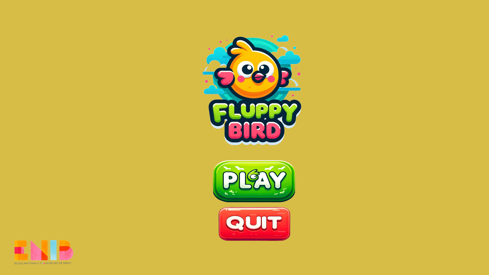
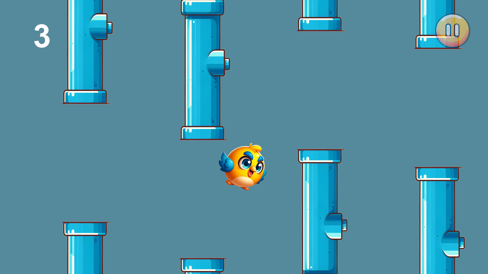
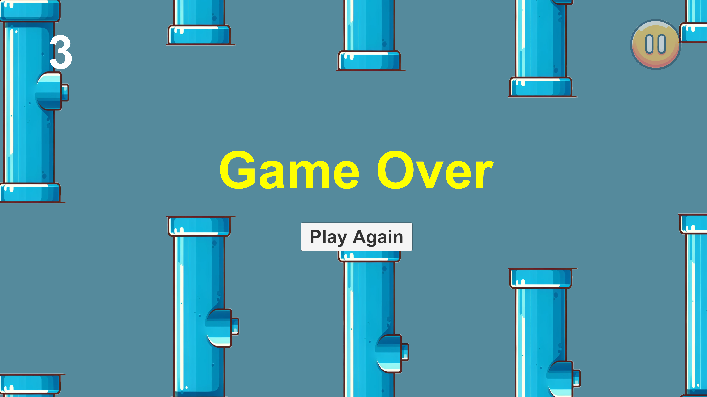

# Unity Flappy Bird Clone
This project is a Flappy Bird clone, developed in Unity as part of a game development
learning process. It includes key features such as sprite management, physics-based movement,
user interface control, and procedural obstacle generation. The goal is to guide a bird through 
randomly generated gaps between pipes without hitting them, earning points along the way.

## Features :

- **Player Movement**: The bird moves vertically by pressing the spacebar, simulating a jump mechanism with Unity’s physics engine.
- **Procedural Obstacles**: Pipes are generated randomly at regular intervals, and the player must navigate the bird through them.
- **Score System**: Players earn points for each set of pipes they successfully pass through, with the score displayed on-screen.
- **Game Over Screen**: Displays when the bird hits an obstacle or falls out of bounds, offering the option to restart or return to the main menu.
- **Pause Menu**: Allows players to pause the game and choose to resume, restart, or exit to the main menu.
- **Start Menu**: A welcoming user interface with options to start or exit the game.

## Technical Details :

### Game Objects and Assets : 
1. **Bird**:
- A GameObject container holding a Sprite Renderer for visuals and a Rigidbody2D component to manage the bird's physics-based movement.
- A Circle Collider 2D is attached to detect collisions with the pipes.
2. **Pipes**:
- Created as parent GameObjects containing child GameObjects for the top and bottom pipes.
- Each pipe has a Sprite Renderer for its visuals and colliders for collision detection.
- Pipes move horizontally using a custom script, and new pipes are generated procedurally using prefabs.

3. **Score System **:
- Triggers placed between the pipes detect when the bird successfully passes through, increasing the score.
- A script updates the visual score display on the user interface in real-time.

4. Game Over:
- When the bird collides with pipes or falls out of bounds, a Game Over screen appears, allowing the player to restart or return to the main menu.

5. User Interface:

- The game includes a Pause Menu with options to resume or quit.
- The Start Menu is designed with a welcoming interface offering the choice to start or exit the game.

## How to Play
- Press the spacebar to make the bird fly higher.
- Avoid colliding with the pipes or falling to the ground.
- Earn points by passing through the gaps between the pipes.
- Try to get the highest score possible!

## Additional Notes from the Project Report:

The bird and pipes' graphical assets were generated using **DALL-E** and imported into Unity.
Throughout the development, various Unity features, including prefabs, Rigidbody2D, 
and colliders, were extensively used to handle object physics and game logic.

## Screenshots:

